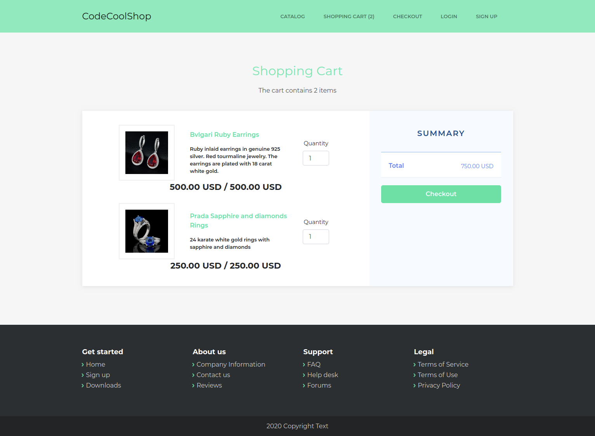

# Codecool Online Shop

Java SE: Web Project skeleton

# Install

Import this project to IntelliJ as a Maven project.
IntelliJ can auto-install the dependencies based on the pom.xml

## The implementation

